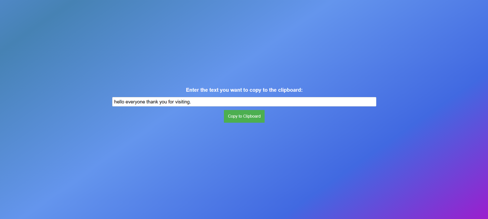
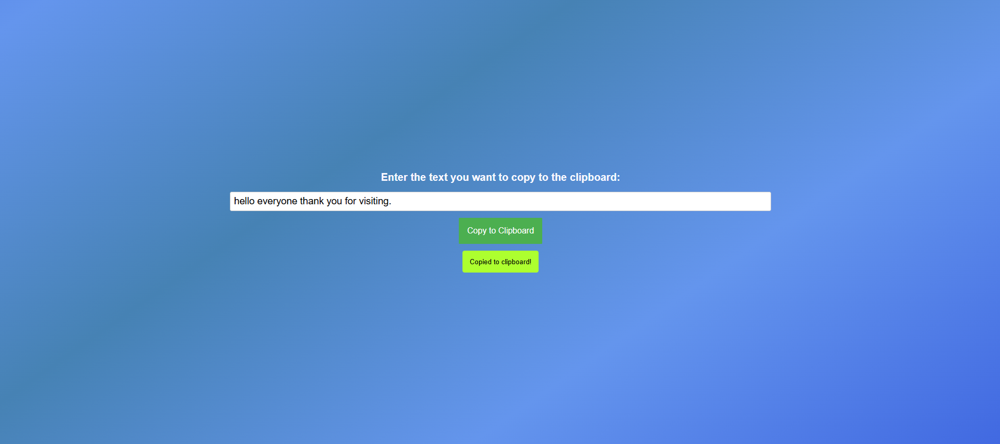
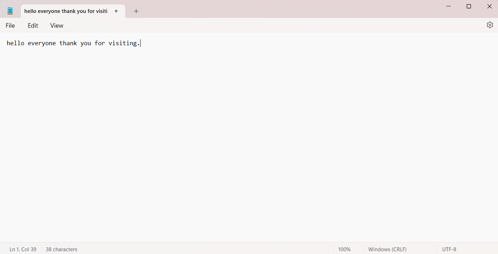

# Copy to Clipboard

## Overview
This project demonstrates a simple copy-to-clipboard functionality along with dynamic input field width adjustment based on the length of the entered text.

## Features
- Dynamically adjusts the width of the input field based on the length of the text.
- Copy text from the input field to the clipboard.
- Displays a message when the text is successfully copied.
- CSS animations for background transitions and messages.

### How It Works
1. **Live Preview**:  
   - Open the `index.html` file in your browser.
   - Enter some text into the input field.  
   
   
2. **Copying to Clipboard**:  
   - Click the "Copy" button.
   - A confirmation message will appear indicating the text has been copied.  
   

3. **Paste in Notepad**:  
   - Open any text editor like Notepad.
   - Paste the copied text.  
   

### Benefits
- **User-Friendly Interface**: The dynamic input width ensures the user always has a visible and easy-to-use input field.
- **Instant Feedback**: The confirmation message gives immediate feedback, enhancing user interaction.
- **Seamless Integration**: The background animations and transitions create a modern, smooth user experience.

### Customization
- You can modify the CSS styles to adjust colors, fonts, or other design elements as per your requirements.
- The JavaScript functionality can be extended to handle additional use cases if needed.
  

### Future Enhancements
- Add support for mobile-friendly designs.
- Implement additional clipboard features such as copying multiple lines of text.
- Include keyboard shortcuts for faster copying.

----
Any feedback or suggestions for further enhancing this functionality are always welcome.

